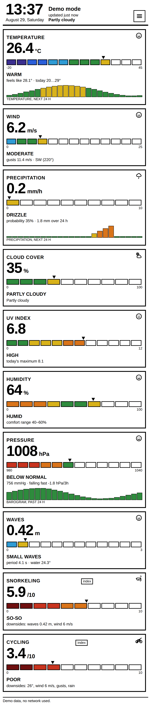
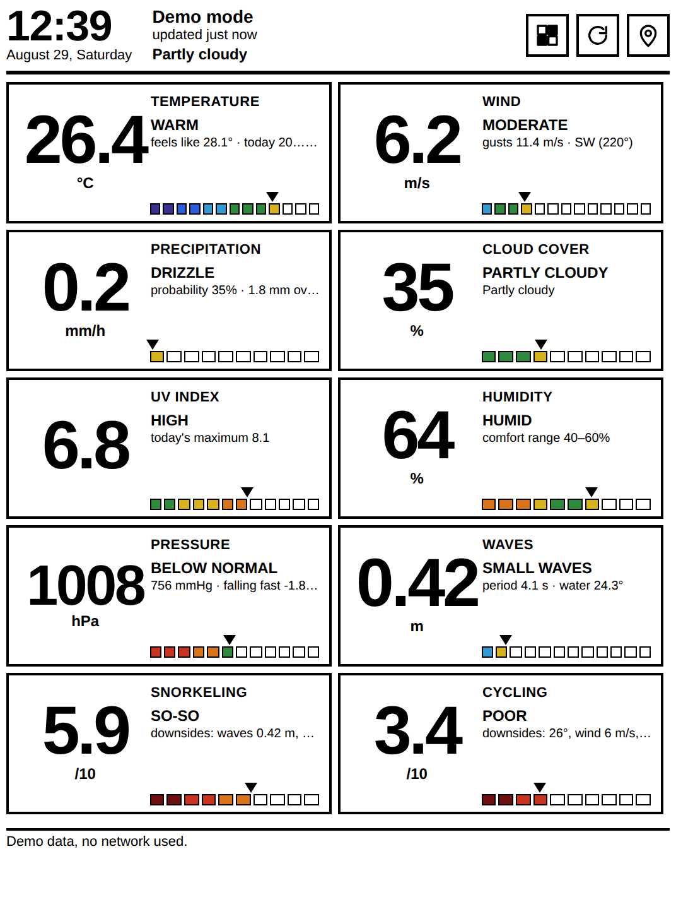
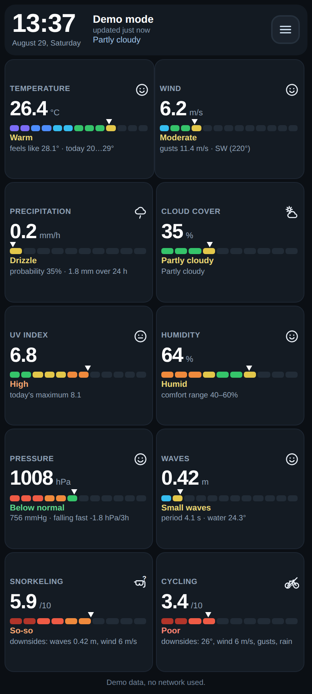
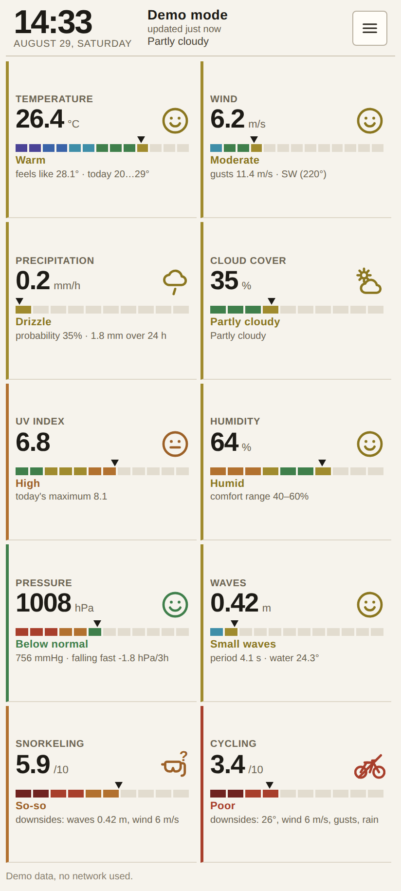

# Barogram — weather with intensity scales

**Open the app: https://vladcherry.github.io/barogram/**
Add it to the home screen on a phone, or open it in the reader's browser.

A weather PWA for the **PocketBook Verse Pro Color** e-reader and for ordinary
phones. Next to every number there is an intensity scale, so you see not just
"6.2 m/s" but where that value sits between dead calm and a storm.

Four designs ship with the app and are cycled from the menu — the filled disc
on the right of the top bar, which turns into a × while the panel is open.

| 1 · E-Ink | 2 · E-Ink Color | 3 · Night | 4 · Light |
|---|---|---|---|
|  |  |  |  |

## Designs

1. **E-Ink** (`eink`) — for the Kaleido screen of the Verse Pro Color: white
   background, 3 px black borders, oversized numbers, the scale drawn as large
   outlined blocks. No shadows, gradients or animation — half-tones smear on
   e-ink and repaints are expensive. Colour appears only inside the scales,
   where Kaleido actually shows it.
2. **E-Ink Color** (`tiles`) — all ten readings on one 6" screen with no
   scrolling: a two-column grid (three columns from 620 px), with the same card
   layout as the other designs — title and icon, number, scale, band label, one
   clipped line of detail. What is different is the ground: each tile is washed
   in the colour of its comfort band, so the screen reads before any number does.
   Text flips to white on the dark grounds and stays black on the light ones,
   every pair clearing WCAG AA for the small labels, and the slider goes
   monochrome (filled segments in the text colour) because the band palette would
   vanish into the tile. The 24-hour charts are dropped here — they are what
   pushes the last tiles below the fold.
3. **Night** (`night`) — for phones: two tiles per row, temperature across the
   full width, 18 px corners, a thin solid scale bar. The dark background is
   easy on an OLED panel and on the eyes at night.
4. **Light** (`paper`) — light paper, a single column of dense rows: label,
   large number, a full-width ruler-like scale and a coloured band marker down
   the left edge of the card. Maximum data per screen.

On a first run nothing is chosen yet, so the app reads the device and picks for
itself: an e-ink reader gets **E-Ink Color** on a colour screen and **Reader** on
a grey one (recognised by the user agent, by `(monochrome)` or by `(update:
slow)`, which is what an e-ink browser reports about a screen it cannot repaint
smoothly), and a phone or a computer gets **Night** or **Light** depending on
its dark-mode setting. From then on the chosen design is remembered and the
detection never runs again. `?theme=tiles` forces one, which is handy for
screenshots.

A horizontal swipe steps through the designs — left for the next one, right for
the previous — and the footer names the one you land on. Vertical movement wins
ties so the page still scrolls, and swipes that start inside the open menu are
left to its buttons.

The top bar holds the clock and a single hamburger button, so the readings get
the rest of the screen. It opens the settings, grouped into four sections —
Appearance, Place, Updates, App — where every setting is a full-width row with
its name on the left and its current value or a switch on the right, so the
panel can be read without opening anything: which language is on, how many cards
are on screen, where the place is, how long ago the weather came in, which build
is running. Design is picked directly from a row of four buttons rather than
cycled, because cycling means four full-screen e-ink repaints to reach the last
one. Picking a design, refreshing or choosing a city closes the panel again.

A full-screen browser (the way a reader is usually set up) hides its own address
bar and reload button, so the menu carries them instead: *Reload page* reloads,
*Update app* unregisters the service worker, drops its caches and reloads — the
reliable way to pick up a new build with no browser chrome around. The version
string next to them shows which build is actually running.

## What it shows

Every reading comes with a number, a scale with coloured bands, a marker at the
current value and a verbal band label.

| Card | Scale | Bands |
|---|---|---|
| Temperature | −20…45 °C | severe frost → comfortable → scorching |
| Wind | 0…25 m/s | calm → moderate → storm (Beaufort boundaries) |
| Precipitation | 0…10 mm/h | dry → drizzle → downpour, plus probability and 24 h total |
| Cloud cover | 0…100 % | clear → overcast, plus the decoded weather code |
| UV index | 0…12 | low → extreme (WHO boundaries) |
| Humidity | 0…100 % | very dry → 40–60 % comfort range → muggy |
| Pressure | 980…1040 hPa | plus mmHg, the 3-hour tendency and a **24 h barogram** |
| Waves | 0…3 m | glassy → storm, with wave period and water temperature |
| Snorkeling | index 0…10 | from waves, water temperature, wind, rain and light |
| Cycling | index 0…10 | from temperature, wind with gusts, rain, UV and mugginess |

Another eighteen cards wait in the library and can be put on the screen at any
time: feels-like, gusts, wind direction (a compass instead of a face), rain
chance, dew point, visibility, water temperature, air quality, PM2.5 and pollen,
plus twelve more outdoor pursuits — running, open-water swimming, tennis,
hiking, fishing from the shore or from a boat, golf, surfing, kite/windsurfing,
camping, drone flying and walking the dog. Each one weighs what actually decides the outing, so
their optima disagree on purpose: the runner wants cool, clean, pollen-free air,
the surfer needs the swell the swimmer is complaining about, the kite card is
the only one that wants it blowing hard, the drone grounds itself on gusts, rain,
haze or a battery-cold morning, the boat adds the chop and the fog the shore
angler can ignore, camping is judged on the night you sleep in rather than the
afternoon, and the dog walk treats heat as the hazard it is for an animal that
cools itself by panting — including the sun-baked pavement that burns paws well
before the air feels dangerous, estimated from sunshine and temperature. Its
thresholds are those of an average mid-sized dog; a husky and a pug sit on
either side of them.

Every card also carries an icon, sitting large in the empty half of the value
row next to the number and painted in the colour of the reading's comfort band —
a solid coloured shape carries further across a room than the thin scale does.
In E-Ink Color the ground already holds that colour, so there the icon stays in
the text colour instead; painting it the same colour would erase it.  The cloud-cover and precipitation cards show
the weather itself — sun, sun behind cloud, fog, rain, snow, thunderstorm, or a
struck-through drop when it is dry. The other readings show a comfort face for
the band they are in, from a smile down to crossed-out eyes. The two sport
indices show the sport: the mask or the bicycle on its own when it is worth
going, with a question mark when conditions are middling (index 4–6), and struck
through when they are bad (below 4). Icons are inline SVG stroked in
`currentColor`, so they follow the card's text colour — including white text on
a coloured tile.

The comfort indices live in `js/metrics.js` (`snorkel`, `bike`): each condition
adds a penalty, the penalties are subtracted from 10, and the card lists what
actually cost the points ("downsides: waves 0.42 m, wind 6 m/s").

Temperature and precipitation carry 24-hour forecast bars; pressure carries the
barogram of the past 24 hours.

## Data

[Open-Meteo](https://open-meteo.com/) — no key, no signup:

* `api.open-meteo.com/v1/forecast` — current values, hourly series, daily extremes;
* `marine-api.open-meteo.com/v1/marine` — waves and water temperature (inland
  there is none, and the waves and snorkeling cards say so plainly);
* `air-quality-api.open-meteo.com/v1/air-quality` — European AQI, PM2.5/PM10 and
  six pollen species, summed into one reading;
* `geocoding-api.open-meteo.com/v1/search` — city lookup by name.

Marine and air-quality data are both optional: neither is allowed to block the
forecast if the endpoint has nothing for that point.

The place comes either from the Geolocation API or from the city search, and
every launch asks the device where it is: a phone that travelled shows the
weather where it woke up without being told. The cached reading is on screen
first — the fix is applied when it arrives, and only if it is more than two
kilometres from the stored point. A place chosen by hand in the city search is
never overwritten, and a refused permission costs nothing, since the browser
answers from its own memory. *My location* in the menu asks again on demand.

Coordinates, where they came from and the last weather snapshot are kept in
`localStorage`, so the app opens with data even with no network.

## Hourly updates, minute-accurate clock

* **The clock** re-renders on the minute boundary (a `setTimeout` to the next
  `:00` second, so it never drifts), not every 60 s from launch.
* **The weather** refreshes 20 seconds past every hour — Open-Meteo publishes
  hourly values, more often buys nothing.
* **Background.** The "Background updates" button asks for notification
  permission and registers Periodic Background Sync (`sw.js`, tag
  `barogram-hourly`, `minInterval` one hour). When it fires, the service worker
  pulls a fresh forecast, caches it and posts a notification — and that
  notification is what wakes the device screen.
* **Coming back to the app.** On `visibilitychange`, data older than 30 minutes
  is re-fetched immediately.
* **Keep screen on** uses `navigator.wakeLock` for desk-clock mode.

Being honest about the limits: a web page can only wake a sleeping device
through the OS. Periodic Background Sync exists in Chromium browsers, only for
an installed PWA, and the browser decides how often to actually call it. The
stock PocketBook browser almost certainly does not support it; there the working
setup is the app kept open with the wake lock on, refreshing on the page's own
hourly timer.

## Tapping a card

A tap opens the card at length, as a sheet over the screen:

* the reading again, with the full scale and its end labels;
* **what it means** — a sentence or two on what the number actually says and
  where its thresholds come from;
* for a comfort index, **what is costing it points right now** and **what went
  into it**: every reading it weighed, with the value each one has at this
  moment;
* **the whole scale** as a table — every band with its range, the current one
  in bold, because a scale whose thresholds cannot be read explains nothing;
* **how it is calculated** — for an index, that it starts at 10 and subtracts
  penalties, plus the conditions that would score full marks; for a reading,
  whatever conversion the app does to it, or that it does none;
* **where the numbers come from** — the Open-Meteo endpoint and the field name
  verbatim, so it can be looked up in their docs, the refresh cadence, the point
  and the time of the last read.

Holding a card still opens the editor instead, a swipe still changes the design,
and Escape (or ×) closes the sheet.

## Rearranging the cards

Hold any card and the screen becomes an editor. A card carries one control
there: a round × on its corner, half off the card, where it cannot be hit while
reaching for something else. The order is changed by dragging — the whole tile
is the handle. A finger has to rest on a card for a third of a second before it
is picked up, so a swipe still scrolls the grid; the card fades when it is in
hand. A mouse grabs on contact, having a wheel for scrolling. The wide bar opens
the library.

The drag moves the card's own element rather than re-rendering the grid on every
swap: a touch keeps firing at the element it started on, so a redraw mid-drag
detaches that element and the rest of the gesture goes nowhere. The new order is
read back out of the grid and saved when the finger comes up. *Default set* restores the ten cards the app ships with, *Done*
leaves the editor. The two of them are one strip the width of the grid — *Done*
filled and the wider half, *Defaults* the outline beside it — and it sits above
the grid and again below it, as does the full-width *Add a card* bar, so nothing
has to be scrolled to at either end of a long screen. The set and its order live in
`localStorage`, so the screen comes back the way it was left. The editor is also
reachable from the menu, and design swipes are suspended while it is open.

The library opens as a sheet over the whole screen rather than as a list under
the grid, which on a phone would start below the fold. It carries a search
field and four groups — Weather, Air, Sea, Sport and outdoors — and every row
shows the card's icon, its name and what it reads right now, so a card can be
judged before it is added. Adding leaves the sheet open and the row simply
disappears from the list; × closes it.

## On a phone

Below 520 px every design switches to a compact layout so the whole set of
readings fits on one screen with no scrolling: two columns, tighter boxes, and
no 24-hour charts — a chart makes a card three times taller than the reading it
carries. Short screens get one more notch of density.

The grid then stretches to fill the screen rather than leaving dead space under
the last row: the app is a column the height of the viewport (`dvh`, so it
follows the browser chrome, with `vh` as the fallback), the card grid takes
whatever the header and footer leave, and its rows share that height. Cards that
grow this way centre their contents instead of clinging to the top. Measured
from 320×568 to 430×932, all four designs fill 99% of the screen with no
scrolling; e-ink readers (536 px and wider) stay on the roomy layout with the
charts.

## Language

All strings live in `js/i18n.js`. English is the source language; Russian,
Ukrainian and Spanish are locales on top of it, and any key a locale misses
falls back to English. The locale is picked from the browser, can be forced with
`?lang=uk`, is cycled with the language button in the **Place** panel and is
remembered. Dates, weekday names and the compass points are localised too.

## Installing it

The app asks to be installed itself: on Chromium it catches the browser's own
install prompt and offers an *Install* button, and where no such prompt exists —
Safari, most of all — the same banner carries the Share → Add to Home Screen
instructions instead. As long as the app is not installed the offer comes back
on every launch — installed is where the hourly wake-up and the offline copy
actually work — and *Later* puts it away until the next one. The menu's *Install
app* brings it back at any time. The banner floats over the cards rather than sitting in the
flow, which would push the last row off a short screen.

**iPhone / iPad.** Open https://vladcherry.github.io/barogram/ **in Safari** —
other iOS browsers cannot install a web app — then Share → *Add to Home Screen*.
It launches full-screen with its own icon and keeps working offline from the
cache. Two iOS limits are worth knowing: there is no Periodic Background Sync,
so the weather refreshes when the app is open (on launch, hourly while it runs,
and whenever you return to it), and notifications would need a push server, so
the "Background updates" button has nothing to switch on there. The layout keeps
clear of the notch and the home indicator via the safe-area insets.

**Android.** Open the same link in Chrome and take *Install app* / *Add to Home
screen*. Background Sync does work here, so the hourly wake-up and its
notification are available once the app is installed.

**PocketBook and other e-readers.** Open the link in the reader's browser, or
copy the folder onto the device and open `index.html`. The menu carries its own
*Reload page* and *Update app*, because a full-screen reader browser has no
address bar.

## Running it

Any static server works (a service worker needs http(s) or localhost):

```bash
python3 -m http.server 8777
# then open http://localhost:8777/
```

To review the layout with no network: `http://localhost:8777/?demo=1`.

On a PocketBook: copy the folder onto the device and open `index.html` in the
browser, or host it anywhere over https (GitHub Pages is enough) and add it to
the home screen.

## Compatibility

The PocketBook browser is far older than a phone's, so the code deliberately
sticks to:

* plain ES5 — `var`, `function`, string concatenation, no arrow functions,
  classes or optional chaining;
* `XMLHttpRequest` instead of `fetch` (the service worker uses `fetch`, which
  exists wherever service workers do);
* CSS without custom properties and without `grid` — flexbox and explicit
  colours per theme;
* no bundler and no dependencies: files are included with plain `<script>` tags.

If the server rejects the extended parameter set, `js/weather.js` retries with a
minimal set of fields so the app still shows the weather.

## Layout

```
index.html              markup (one shell for all three designs)
css/base.css            structure and geometry
css/theme-eink.css      design 1
css/theme-night.css     design 3
css/theme-paper.css     design 4 (Light)
css/theme-tiles.css     design 2 (E-Ink Color)
css/compact.css         phone layout: one screen, no scrolling (loaded last)
js/i18n.js              all user-facing strings: English source + ru/uk/es locales
js/util.js              helpers, XHR, formatting, weather codes
js/store.js             settings and cache in localStorage
js/metrics.js           scale bands and comfort-index maths
js/icons.js             card icons: weather, comfort faces, sports with a verdict
js/scale.js             scale, card and mini-chart rendering
js/detail.js            the card sheet: meaning, bands, inputs, sources
js/weather.js           Open-Meteo requests and normalisation
js/app.js               screen, clock, schedule, background work
sw.js                   offline cache, hourly periodicsync, notifications
tools/make_icons.py     PNG icon generation with no third-party libraries
```
